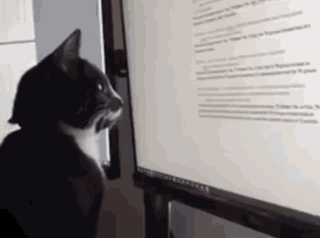

# DIGHUM101-2022: Practicing the Digital Humanities (Practicum)

[Practicing the Digital Humanities, UC Berkeley Summer Session 2023](https://classes.berkeley.edu/content/2023-summer-dighum-101-001-lec-001)

Instructor: [Prashant Sharma](https://www.linkedin.com/in/prashant3123)

[UC Berkeley D-Lab](https://dlab.berkeley.edu/)

- May 22 2023 - Jun 30 2023
- M, TU, W, TH
- 1:00 pm - 2:59 pm
- Internet/Online

## Welcome to DIGHUM101!

### Course overview
The digital and data revolution has begun to transform the study of the humanities by introducing new archival data sources, tools and methods, and modes of analysis. In this applied course, students will use tools and data of ongoing projects associated with the Digital Humanities at Berkeley and beyond to explore the scope of the field, and to gain a foundational knowledge of several digital tools through hands-on work. By the end of this course, students will have a firm grasp of data structures, methods, and libraries in Python, as well as the fundamentals of popular digital humanities methods such as computational text analysis, network analysis, and geospatial analysis.

### The structure of this GitHub repository is as follows:

### Directories
- **Data/**  The Data directory contains several example datasets we will work through together during class time and for challenge questions. Think bigger for your project!

- **Files/**  Houses the syllabus, University legal language, and a few resources that are posted to bCourses.  

- **Img/**  Has the images used throughout this repository.

- **Notebooks/**  Your Jupyter Notebooks, challenge questions, and solutions.

### Files
- **.gitignore**  A file for ignoring changes to this repository

- **1-1setup.pdf**  Read this first!

- **README.md**  Contains the text on this page.

- **requirements.txt**  Python libraries used in the notebooks.

### DataHub

Are you having trouble installing Python, importing data, or otherwise running the notebooks? Click [this link](https://datahub.berkeley.edu/hub/user-redirect/git-pull?repo=https%3A%2F%2Fgithub.com%2Fdlab-berkeley%2FDIGHUM101-2022&urlpath=lab%2Ftree%2FDIGHUM101-2022%2F) to open our notebooks in Berkeley DataHub, which allows you to run the notebooks in the cloud (Berkeley account required).

### Past Courses
Parts of these materials were created by Evan Muzzall, 2018-2021, Brooks Jessup, 2021, and Tom van Nuenen, 2022. 
- https://github.com/dlab-berkeley/DIGHUM101-2022
- https://github.com/dlab-berkeley/DIGHUM101-2021
- https://github.com/dlab-berkeley/DIGHUM101-2020
- https://github.com/dlab-berkeley/DIGHUM101-2019
- https://github.com/dlab-berkeley/DIGHUM101-2018
